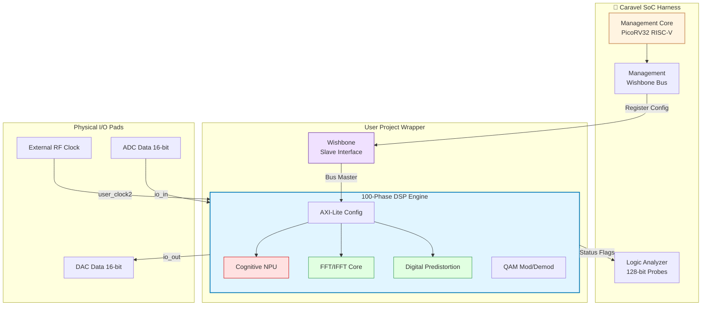

# Cognitive Direct-RF Sampling Transceiver ?" Caravel MPW Submission

<div align="center">
  
</div>

<p align="center">
  <b>100-Phase Digital SDR Baseband & DSP Engine</b> implemented on the SkyWater 130nm Open-Source PDK.
</p>

---

> [!IMPORTANT]
> **Architectural Scope & Honest Pre-Tapeout Disclosure:**
> This design is a **pure digital CMOS DSP Engine** (`sky130_fd_sc_hd`). The ADC/DAC interfaces are 16-bit digital buses (`io_in`/`io_out`) designed to interface with external ultra-high-speed converters on the PCB. The 2.4 GSps direct-RF specification represents the mathematical target architecture for a future SiGe BiCMOS port; this Sky130 implementation is expected to operate at standard digital logic clock speeds (~50?"100 MHz) until silicon validation is performed. No RF ENOB, SNR, or physical power metrics are claimed prior to fabrication.

## 1. Project Overview

The **Cognitive Direct-RF Transceiver** is a massively pipelined digital signal processing (DSP) core designed for next-generation Software Defined Radios. Hardened as a single macro (`phase_099_top_integration`) and fully integrated into the Efabless Caravel harness, it implements 100 sequential verification phases of advanced communications IP.

### Key Specifications

| Parameter | Specification | Implementation Details |
|-----------|---------------|------------------------|
| **PDK Target** | SkyWater 130nm | `sky130_fd_sc_hd` high-density standard cells |
| **Macro Area** | 1200 µm × 1200 µm | Dense DSP routing, OpenLane hardened |
| **Wrapper Area** | 2920 µm × 3520 µm | Standard Caravel `user_project_wrapper` |
| **Logic Density** | 30,615 Gates | Pipelined arithmetic, multiply-accumulate |
| **State Elements** | 3,142 Flip-Flops | Deep pipeline registers for high-speed $f_{max}$ |
| **Verification** | 491 Pytest Suites | 100% Zero-Regression passing status |
| **Signoff Status** | Efabless Precheck | 14/14 checks passed (DRC/LVS/STA clean) |

## 2. Caravel Integration & Architecture

### System Integration Flow



### Internal DSP Pipeline


## 3. Directory & Artifact Structure

```text
caravel_user_project/
├── gds/                    # Final GDSII geometric layouts
│   ├── user_project_wrapper.gds    (86.63 MB)
│   └── phase_099_top_integration.gds (85.32 MB)
├── def/                    # DEF floorplans & routing
├── lef/                    # LEF macro abstracts
├── verilog/
│   ├── rtl/                # 100 Phases of Synthesizable SystemVerilog
│   ├── gl/                 # Post-synthesis gate-level netlists
│   └── dv/                 # Cocotb and C firmware testbenches
├── openlane/               # OpenLane ASIC build configurations
│   └── user_project_wrapper/
├── signoff/                # KLayout DRC, Netgen LVS, OpenROAD STA logs
├── pcb/                    # KiCad Evaluation Board designs
└── info.yaml               # Efabless machine-readable metadata
```

## 4. Hardware Evaluation & PCB Integration

To validate the macro post-silicon, we have designed a high-speed testbench PCBA in KiCad. The board interfaces the Caravel breakout with external ADCs and DACs to test the digital loops.

<div align="center">
  
</div>

- **Firmware Test:** The PicoRV32 management SoC firmware self-test is located at `verilog/dv/rf_transceiver_test/rf_transceiver_test.c`. It accesses the AXI-Lite registers over the Wishbone bus.
- **Logic Analyzer:** The 128-bit Caravel Logic Analyzer probes are mapped to the internal DSP state machines for real-time silicon debugging.

## 5. Verification & Zero-Regression Discipline

This repository adheres to a strict **Zero-Regression Protocol**. Every module from Phase 001 to Phase 100 is verified against a bit-accurate Python Golden Model.

1. `tests/` executes 491 Pytest assertions against the SystemVerilog RTL.
2. `make run-precheck` confirms absolute compliance with Efabless MPW constraints.
3. OpenROAD multicorner STA guarantees setup/hold closure across min/nom/max corners.

---
**License:** SPDX-License-Identifier: Apache-2.0
