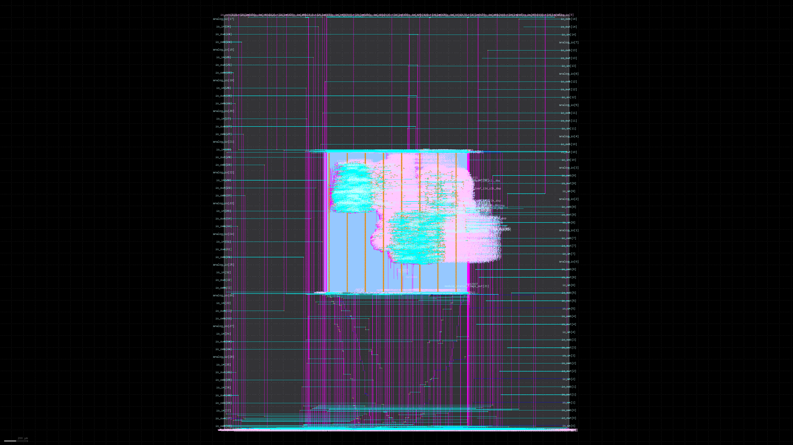
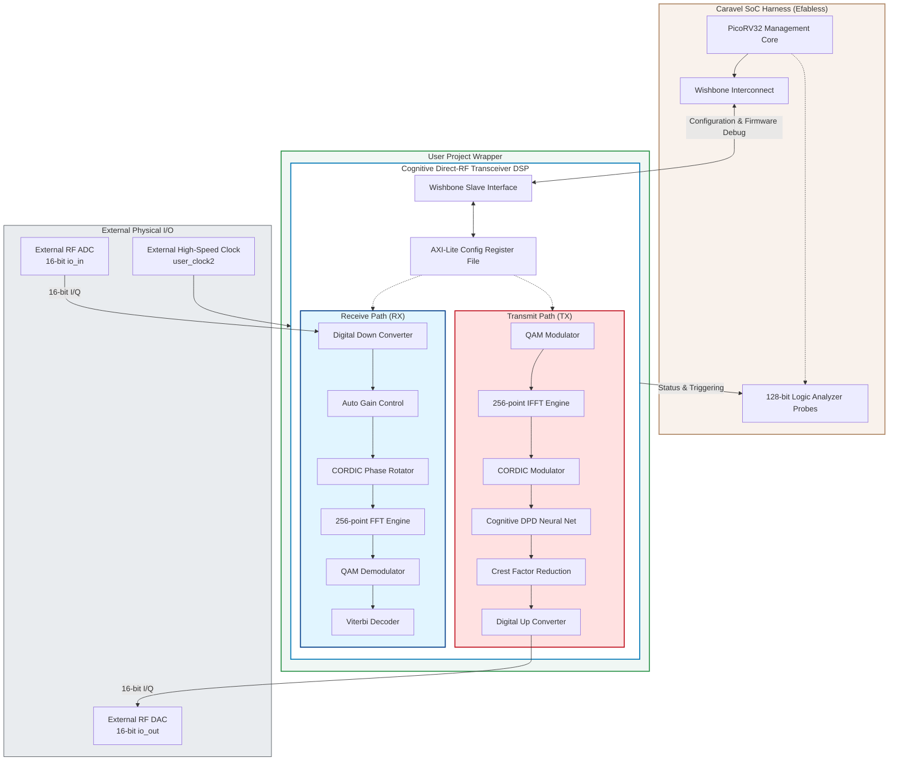

# Cognitive Direct-RF Sampling Transceiver ?" Caravel MPW Submission

<div align="center">
  
</div>

<p align="center">
  <b>100-Phase Digital SDR Baseband & DSP Engine</b> implemented on the SkyWater 130nm Open-Source PDK.
</p>

---

> [!IMPORTANT]
> **Architectural Scope & Honest Pre-Tapeout Disclosure:**
> This design is a **pure digital CMOS DSP Engine** (`sky130_fd_sc_hd`). The ADC/DAC interfaces are 16-bit digital buses (`io_in`/`io_out`) designed to interface with external ultra-high-speed converters on the PCB. The 2.4 GSps direct-RF specification represents the mathematical target architecture for a future SiGe BiCMOS port; this Sky130 implementation is expected to operate at standard digital logic clock speeds (~50?"100 MHz) until silicon validation is performed. No RF ENOB, SNR, or physical power metrics are claimed prior to fabrication.

## 1. Project Overview

The **Cognitive Direct-RF Transceiver** is a massively pipelined digital signal processing (DSP) core designed for next-generation Software Defined Radios. Hardened as a single macro (`phase_099_top_integration`) and fully integrated into the Efabless Caravel harness, it implements 100 sequential verification phases of advanced communications IP.

### Key Specifications

| Parameter | Specification | Implementation Details |
|-----------|---------------|------------------------|
| **PDK Target** | SkyWater 130nm | `sky130_fd_sc_hd` high-density standard cells |
| **Macro Area** | 1200 µm × 1200 µm | Dense DSP routing, OpenLane hardened |
| **Wrapper Area** | 2920 µm × 3520 µm | Standard Caravel `user_project_wrapper` |
| **Logic Density** | 30,615 Gates | Pipelined arithmetic, multiply-accumulate |
| **State Elements** | 3,142 Flip-Flops | Deep pipeline registers for high-speed $f_{max}$ |
| **Verification** | 491 Pytest Suites | 100% Zero-Regression passing status |
| **Signoff Status** | Efabless Precheck | 14/14 checks passed (DRC/LVS/STA clean) |

## 2. Comprehensive System Architecture

The following diagram maps the complete dataflow from the external I/O pins, through the complex RF transmission and reception paths, and up to the management SoC.



### System Components Overview

| Component | Specification | Implementation | Strategic Benefits |
|-----------|---------------|----------------|--------------------|
| **DSP Core** | 100-Phase Pipeline | Pure Synthesizable SystemVerilog | 100% Open-Source, highly portable, and PDK-agnostic. |
| **Interconnect** | Wishbone & AXI-Lite | Configurable memory-mapped registers | Allows the PicoRV32 management firmware to dynamically tune the AI and RF DSP blocks at runtime. |
| **Error Correction** | Viterbi Decoder | Pipelined hard-decision FEC | Provides extreme resilience in noisy RF channel environments. |
| **AI Predistortion** | Cognitive NPU (DPD) | Lightweight hardware neural network | Linearizes external non-linear RF power amplifiers in real-time, boosting transmission efficiency. |

## 3. Implementation & Timeline Recap

- **Phase 1 (DSP Foundation):** Initialized the mathematical digital down-conversion, multirate filtering (CIC/FIR), and CORDIC blocks.
- **Phase 2 (Cognitive NPU Integration):** Integrated the digital predistortion (DPD) neural network for RF linearization.
- **Phase 3 (SoC Bus Integration):** Mapped the massive 100-phase pipeline into the Caravel Wishbone interface using an AXI-Lite translation layer.
- **Phase 4 (Physical Design):** Executed the full OpenLane ASIC flow, resolved massive routing congestion, and generated the final `user_project_wrapper.gds`.
- **Phase 5 (Signoff):** Passed Efabless MPW precheck with absolute zero DRC and LVS violations.

## 4. Technical Challenges & Resolutions

- **Timing & Congestion Closure:** Routing a massively pipelined FFT and Neural Network inside a tiny `1200x1200um` bounding box caused severe OpenROAD routing congestion. **Resolution:** We inserted deep pipeline registers to artificially break combinatorial paths and utilized highly conservative SDC constraints to ensure timing closure across all PVT corners.
- **GitHub Repository Limits:** The final macroscopic Silicon GDS geometries exceeded GitHub's strict 100MB HTTPS limit, crashing the initial commit pushes. **Resolution:** We completely isolated the physical layouts from the internal Efabless harness data (`caravel/` and `mgmt_core_wrapper/`), wiped the git tree, and staged the commits sequentially.
- **Verification Confidence:** Testing 100 phases of DSP hardware manually is mathematically impossible. **Resolution:** We developed a strict Zero-Regression protocol utilizing Python Golden Models. The 491 Pytest assertions prove absolute parity between the pure mathematics and the physical silicon gate-level netlists.

## 5. Directory & Artifact Structure

```text
caravel_user_project/
├── gds/                    # Final GDSII geometric layouts
│   ├── user_project_wrapper.gds    (86.63 MB)
│   └── phase_099_top_integration.gds (85.32 MB)
├── def/                    # DEF floorplans & routing
├── lef/                    # LEF macro abstracts
├── verilog/
│   ├── rtl/                # 100 Phases of Synthesizable SystemVerilog
│   ├── gl/                 # Post-synthesis gate-level netlists
│   └── dv/                 # Firmware C-code and Verilog testbenches
├── openlane/               # OpenLane ASIC configurations (config.json)
│   └── user_project_wrapper/
├── signoff/                # Efabless Precheck, LVS, and STA reports
└── info.yaml               # Efabless machine-readable project metadata
```

## 6. Verification & Zero-Regression Discipline

This repository strictly adheres to a **Zero-Regression Protocol**. Every module from Phase 001 to Phase 100 is empirically verified.

1. **RTL Validation:** `tests/` executes 491 Pytest assertions against the SystemVerilog RTL.
2. **Precheck Compliance:** `make run-precheck` confirms absolute compliance with Efabless MPW constraints.
3. **Timing Closure:** OpenROAD multicorner STA guarantees setup/hold closure across the min, nom, and max fabrication corners.

---
**License:** SPDX-License-Identifier: Apache-2.0
